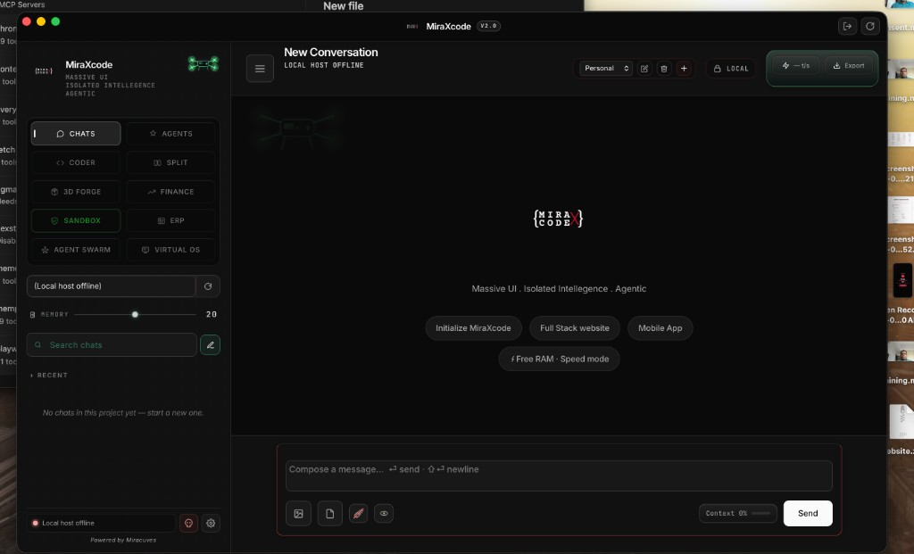
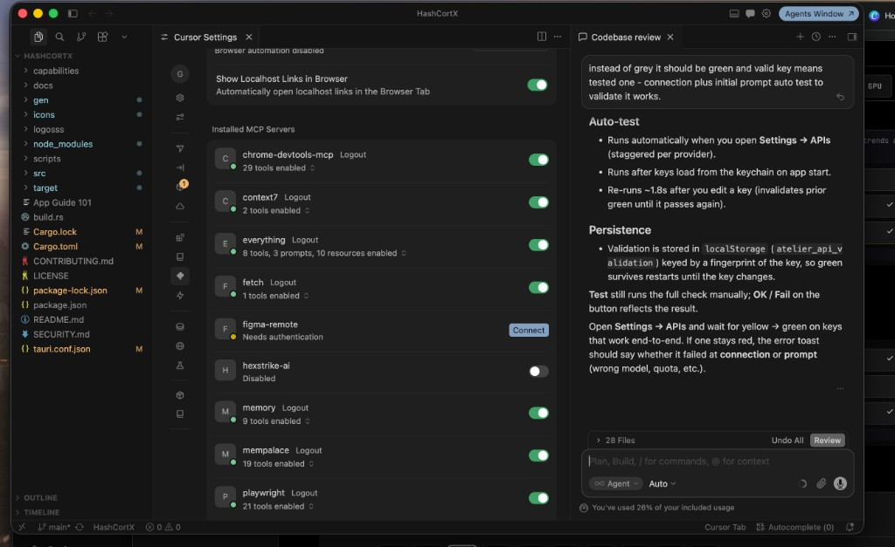
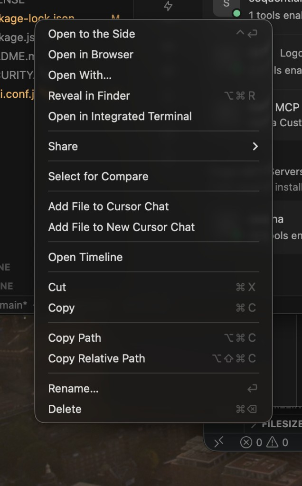
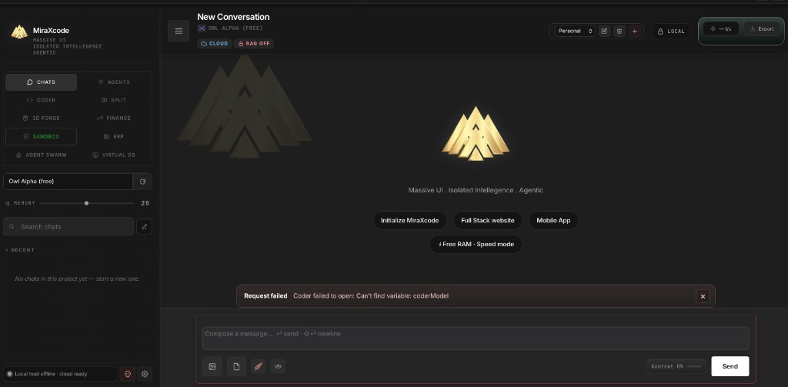
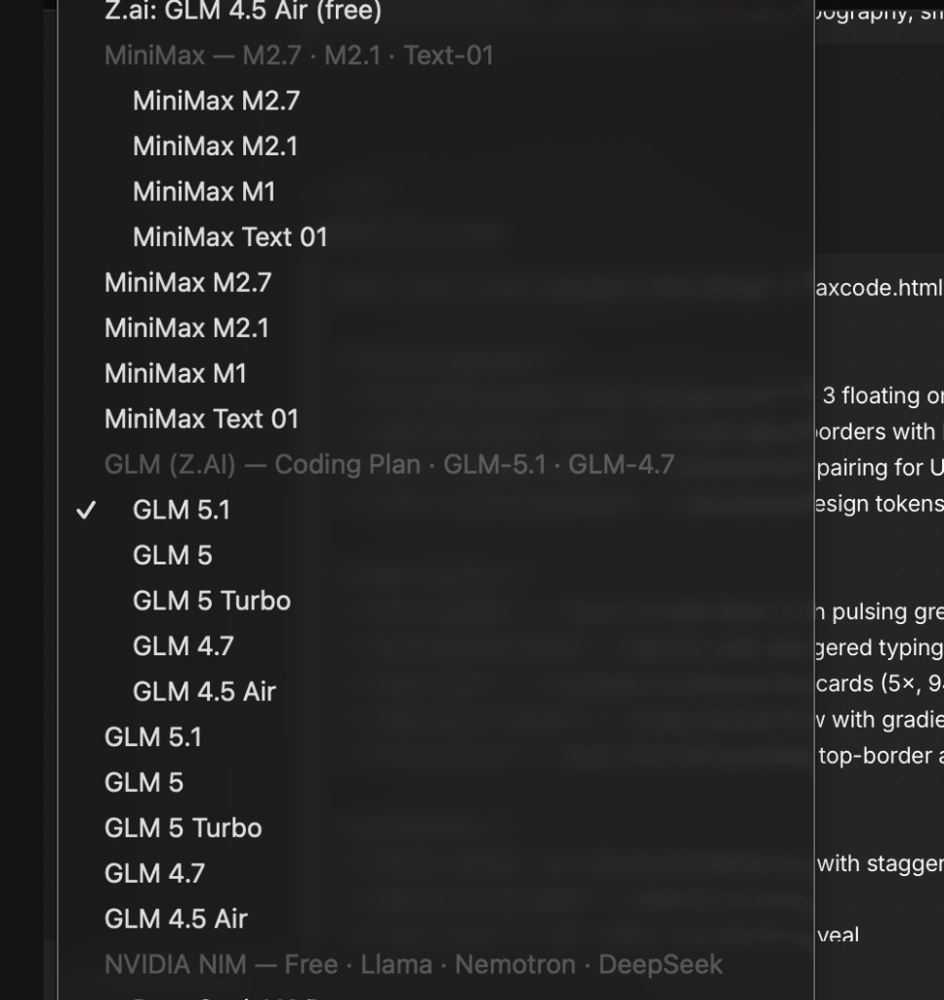

<div align="center">



# MiraXCode

**Local-first AI workspace · Eleven modes · Thirteen cloud providers · Zero telemetry**

[Repository](https://github.com/miracuves/miraxcode) · [Issues](https://github.com/miracuves/miraxcode/issues) · [Discussions](https://github.com/miracuves/miraxcode/discussions) · [Miracuves](https://www.miracuves.com)


</div>

---

## What is MiraXCode?

**MiraXCode** is a native desktop AI application (Tauri v2 + Rust + modular JavaScript) that unifies chat, coding, swarms, research, finance, security scanning, 3D planning, ERP prototyping, and a virtual project OS — with **bring-your-own-key** access to major model providers and optional **fully offline** use via Ollama.

- **No MiraXCode cloud** — requests go straight to providers you configure  
- **OS keychain** for API keys (stripped from settings JSON on save)  
- **No telemetry** — no accounts, no usage pipeline  
- **Aura monochrome UI** — black/grey/white, Cursor-inspired density and typography (Inter + JetBrains Mono)

Maintained by **[Miracuves](https://www.miracuves.com)**. See [CONTRIBUTORS.md](CONTRIBUTORS.md).

---

## Screenshots

| Main workspace (Chats) | MiraXCode Coder (IDE) |
|---|---|
|  |  |

| Settings & providers | Agents / swarm |
|---|---|
|  |  |

| Full workspace overview |
|---|
|  |

---

## Supported providers

### Cloud LLM providers (API key in Settings → APIs)

Each row below has a **connectivity test**, **keychain storage**, and (where applicable) a **live model catalog** in the app.

| Provider | Key field | Notes |
|---|---|---|
| **Groq** | `groqKey` | Fast Llama / OSS models |
| **Google Gemini** | `geminiKey` | Gemini 2.x + image generation models |
| **OpenAI** | `openaiKey` | GPT-4o family, o3-mini |
| **Anthropic** | `anthropicKey` | Claude Sonnet / Opus 4, Claude 3.5 |
| **Moonshot (Kimi)** | `moonshotKey` | Multi-base failover; `sk-ki…` Anthropic-compatible routes |
| **DeepSeek** | `deepseekKey` | V3 chat + R1 reasoner |
| **Mistral** | `mistralKey` | Mistral Large, Codestral, Medium |
| **Cerebras** | `cerebrasKey` | Ultra-fast Llama inference |
| **SambaNova** | `sambaKey` | Large open-weight hosting (Llama 4, 405B, DeepSeek, …) |
| **OpenRouter** | `openRouterKey` | Meta-gateway; **live free-model fetch** on startup |
| **NVIDIA NIM** | `nvidiaKey` | `integrate.api.nvidia.com` — Nemotron, DeepSeek, Llama NIMs |
| **MiniMax** | `minimaxKey` | M2.7, M2.1, M1, Text-01 |
| **GLM (Z.AI Coding Plan)** | `glmKey` | GLM-5.1, GLM-5, GLM-4.7, GLM-4.5-air via Z.AI API |

### Local inference

| Provider | Setup |
|---|---|
| **Ollama** | Any model on your host — presets for localhost / LAN; **Free RAM** unloads tracked models |

### Research & routing (optional keys)

Used by the auto-router and specialist agents — not chat LLMs themselves:

| Service | Key fields | Used for |
|---|---|---|
| **Tavily** | `tavilyKey` | Web search in agent tools / router |
| **Google Custom Search** | `googleKey` + `googleCx` | Web search fallback |
| **Wikipedia / PubMed** | — | Built-in public APIs in routing layer |

Cloud model IDs use the `cloud:<provider>:<model>` scheme with **per-provider failover** preferences in Settings.

---

## The 11 modes

| # | Mode | Purpose |
|---|---|---|
| 1 | **Chats** | Multi-provider chat, projects, attachments, slash commands, templates, exports |
| 2 | **Agents** | Built-in specialists + custom agents (Agent Maker) |
| 3 | **Code (MiraXCode Coder)** | Monaco IDE, LSP, diagnostics, project RAG, command palette, agent tools, shell |
| 4 | **Split** | Two models, same prompt, side by side |
| 5 | **3D Forge** | Spatial / architecture planning agent |
| 6 | **Finance AI** | Statements & spreadsheets — grounded KPIs, no invented numbers |
| 7 | **Sandbox** | Swarm security scan on untrusted code / AI output |
| 8 | **ERP / Systems Builder** | Interactive prototypes from workflow descriptions |
| 9 | **Agent Swarm** | Multi-agent pipelines, voting/chain, provider failover |
| 10 | **Virtual OS** | Simulated desktop file workspace for agents |
| 11 | **Agent Maker** | No-code agent builder (prompt, icon, tools) |

Details: [MODES_GUIDE.txt](MODES_GUIDE.txt)

---

## Built-in agents (9)

| Agent | Role |
|---|---|
| **MiraXcode** | Personal assistant — memory, web, Python sandbox, exports |
| **MiraXcode Lite** | Fast lightweight assistant |
| **Researcher** | Web + memory research |
| **Deep Research** | Long-form multi-step research |
| **Coder** | Engineering-focused coding agent |
| **URL Reader** | Fetch and analyze pages |
| **Published Papers Researcher** | PubMed-grounded literature |
| **Medical Lexi-Check** | Drug / interaction checking (source-grounded) |
| **ATS CV Auditor** | Resume / ATS analysis |

Custom agents can be added in **Agent Maker** with curated tool sets.

---

## Platform features (shipped in this repo)

### Shell (`src/js/app/` — esbuild bundle)

- **40+ modules** — providers, features, UI, core; `bootstrap.js` wiring + stable `window._H` bridge  
- **Projects** — workspaces, instructions, memory mode, agent run traces  
- **Memory** — fact store, synonym recall, auto-extract from chat  
- **RAG** — local KB + project ingest (`CdrProjectRag`)  
- **MCP** — server scan, tool discovery, agent tool bridge  
- **Routing** — classify prompts → local vs NVIDIA + search; Tavily / Google / Wiki / PubMed  
- **Chat stream** — streaming, compare, abort, context indicator, compaction  
- **File ingest** — images, PDFs, text in composer  
- **Templates & slash palette** — prompt library with `{{var}}`  
- **Settings** — API key tests, usage chips, backend sync (optional dev server), privacy-local  
- **Dialogs, shortcuts, command palette** — selection toolbar (quote / explain / fix)

### Coder / IDE

- **Monaco** editor (bundled)  
- **LSP client**, **diagnostics** (TS, Rust, …)  
- **Command palette**, goto, mentions, virtualized chat  
- **Project lint**, staged reads, file-stage workflow  
- **Coder memory & skills**, Graphify hooks  
- **Native HTTP / SSE** in Tauri for provider calls

### Security & ops

- **Permission guard** + **audit log** (Rust)  
- **HcStorage** — capped chat persistence  
- **HcHealth** — local-only error capture  
- **CI** — build + `npm test` (storage, diagnostics, module smoke tests)

### UI

- **Aura theme** — monochrome panels, dot grid, white primary actions  
- **Neutral lock** — no stray accent colors in chrome  
- **MiraXCode branding** — logo across shell, about, dock icon (`npm run icons`)

---

## Install

### macOS (Apple Silicon)

1. Download **MiraXcode** from [Releases](https://github.com/miracuves/miraxcode/releases) when available  
2. Drag to `/Applications`  
3. First launch (unsigned build): right-click → **Open** → **Open**  
4. **Settings → APIs** — add keys, or use **Ollama** only  

```bash
xattr -dr com.apple.quarantine /Applications/MiraXcode.app
```

---

## Build from source

```bash
git clone https://github.com/miracuves/miraxcode.git
cd miraxcode
npm install
npm run build:js
npm run tauri dev
```

Release:

```bash
npm run tauri build
```

Tests:

```bash
npm test
```

**Requirements:** macOS (primary), Node 18+, Rust, Xcode CLT.

---

## Tech stack

| Layer | Technology |
|---|---|
| Shell | Tauri v2, Rust |
| Frontend | ES modules → **esbuild** → `app.bundle.js` |
| Modes | esbuild bundles: `code-mode.bundle.js`, `virtual-os.bundle.js`; sources in `src/js/modes/` |
| Editor | Monaco |
| Secrets | macOS Keychain (`keyring` crate) |
| Styles | Aura / UI v3 CSS layers on design tokens |

---

## Privacy

- Direct provider HTTPS only — no MiraXCode intermediary  
- Keys in keychain; not in git  
- Guarded FS/shell for coding agents  
- Full offline path with Ollama  

[SECURITY.md](SECURITY.md) · [docs/PRODUCTION.md](docs/PRODUCTION.md)

---

## Keyboard shortcuts

| Shortcut | Action |
|---|---|
| `Cmd/Ctrl + Shift + N` | New chat |
| `Cmd/Ctrl + Shift + C` | Toggle Coder mode |
| `Cmd/Ctrl + K` | Focus model picker |

---

## Documentation

| Doc | Topic |
|---|---|
| [src/js/app/README.md](src/js/app/README.md) | Module map & boot order |
| [docs/ARCHITECTURE.md](docs/ARCHITECTURE.md) | Repo layout |
| [docs/WAVE8.md](docs/WAVE8.md) | Shell modularization |
| [docs/BRAND.md](docs/BRAND.md) | Naming |
| [CONTRIBUTING.md](CONTRIBUTING.md) | How to contribute |
| [CONTRIBUTORS.md](CONTRIBUTORS.md) | Maintainers |

---

## Contributing

Contributions welcome under MIT. Maintained by **Miracuves** — see [CONTRIBUTING.md](CONTRIBUTING.md). Please do not submit third-party branding or unrelated author credits in docs.

---

## License

MIT — [LICENSE](LICENSE). Copyright **Miracuves** (2026).

---

<div align="center">

**MiraXCode** · [github.com/miracuves/miraxcode](https://github.com/miracuves/miraxcode)

</div>
